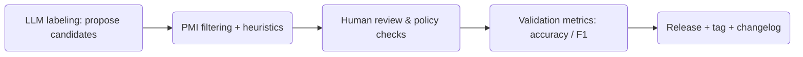

# Taiwan Financial Sentiment Dictionary

This repository publishes an open, versioned dictionary for sentiment analysis of Traditional Chinese financial news in Taiwan. It includes the lexicon in Excel format (XLSX), a clear versioning and release policy, quality-assurance checks, and documentation of the construction workflow (LLM labeling → PMI filtering → human or LLM validation).

## Quick start
- Download the current release from the **Releases** page once you publish this repo.
- Data files live in `data/`:
  - `RemiDictionary.xlsx` — Main financial sentiment dictionary
  - `TopicExchangeRate.xlsx` — Topic lexicon: Exchange Rate 
  - `TopicGrowth.xlsx` — Topic lexicon: Growth 
  - `TopicInterestRate.xlsx` — Topic lexicon: Interest Rate 
  - `TopicMonetaryPolicy.xlsx` — Topic lexicon: Monetary Policy 
  - `TopicPrice.xlsx` — Topic lexicon: Price


## Versioning & release schedule
- **Scheme**: `2025.06.01` (`YYYY.MM.PATCH`). Year–month reflect the release window; PATCH increments for hotfixes that do not change definitions.
- **Schedule**: Annual releases (December). Event-driven hotfixes are allowed.
- **Frozen archives**: Every release is tagged and published on GitHub Releases. Users can cite a specific version for replication.
- **Changelog**: See `CHANGELOG.md` for human-readable changes.

## Citation & DOI
-  [](https://doi.org/10.5281/zenodo.17076771
Also provide citation metadata in `CITATION.cff`.

## Licenses
- **Code**: MIT License (see `LICENSE-CODE`).
- **Data**: Creative Commons Attribution 4.0 International (CC BY 4.0) (see `LICENSE-DATA`).

## Construction workflow

- Full details are in `WORKFLOW.md`, including checkpoints, error metrics, and QA steps.

## Governance & deprecation policy
- Rules for retiring obsolete terms and blocking short-lived buzzwords are in `POLICY.md`.
- Contributions follow `CONTRIBUTING.md` and `CODE_OF_CONDUCT.md`.
- Use GitHub Issues to propose new terms; each term should include source examples and justification.

## Download formats
- Excel provided. R/Python usage snippets are included below.

### Load in R
```r
library(openxlsx)
library(stringr)
rPathFile= "data/RemiDictionary.xlsx"
sentence = "亞洲方面，日本因經濟復甦漸趨明朗，日本央行於八月間結束零利率政策，將無擔保隔夜拆款利率的操作目標調高至Ｏ．二五%，惟因通貨緊縮現象暫難消除，寬鬆貨幣政策的立場仍然不變；"
Positive = read.xlsx(rPathFile, "Positive")[, 1]
Negative = read.xlsx(rPathFile, "Negative")[, 1]

# 計算情感詞的函數
CountSentiment = function(str_v, sentiment_v, replace_c = '***'){
   result   = rep(0, length(str_v))
   for(i in 1:length(sentiment_v)){
      check    = str_detect(str_v, sentiment_v[i])
      if(sum(check) > 0){
         result = result + check
         str_v  = str_replace_all(str_v, sentiment_v[i], replace_c)
      }
   }
   return(result)
}

# 計算正面和負面詞的數量
n.positive = CountSentiment(sentence, Positive)
n.negative = CountSentiment(sentence, Negative)

cat('正面詞數量: ', n.positive, '\n')
cat('負面詞數量: ', n.negative, '\n')
```
### Load in Python
```python
import pandas as pd
import re

# 讀取 Excel 中的字典
rPathFile = "data/RemiDictionary.xlsx"
positive_words = pd.read_excel(rPathFile, sheet_name="Positive").iloc[:, 0].tolist()
negative_words = pd.read_excel(rPathFile, sheet_name="Negative").iloc[:, 0].tolist()

sentence = "亞洲方面，日本因經濟復甦漸趨明朗，日本央行於八月間結束零利率政策，將無擔保隔夜拆款利率的操作目標調高至Ｏ．二五%，惟因通貨緊縮現象暫難消除，寬鬆貨幣政策的立場仍然不變；"

# 計算情感詞的函數
def count_sentiment(str_v, sentiment_v, replace_c='***'):
    result = 0
    for word in sentiment_v:
        if re.search(word, str_v):
            result += len(re.findall(word, str_v))
            str_v = re.sub(word, replace_c, str_v)
    return result

# 計算正面和負面詞的數量
n_positive = count_sentiment(sentence, positive_words)
n_negative = count_sentiment(sentence, negative_words)

print(f"正面詞數量: {n_positive}")
print(f"負面詞數量: {n_negative}")

```

