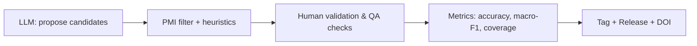

# Construction Workflow

## Pipeline overview
1. **LLM labeling** produces candidate terms with provisional polarity labels.
2. **PMI filtering** and heuristics remove low-signal items and rank candidates.
3. **Human validation & QA** confirm labels and enforce policy rules.
4. **Metrics** are computed on a held-out validation set (accuracy, macro-F1, coverage).
5. **Release**: bump version, update `CHANGELOG.md`, create Git tag and GitHub Release, attach data assets.

## Checkpoints
- **Schema check**: column names, types, allowed label set.
- **Uniqueness**: no duplicate `term` + `label` combinations.
- **Encoding**: UTF-8 only.
- **Policy**: deprecation flags, blocked terms respected.

## Error metrics
See `scripts/metrics_example.py` and `data/validation_sample.csv`.
